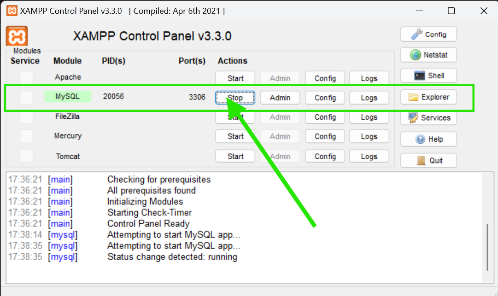
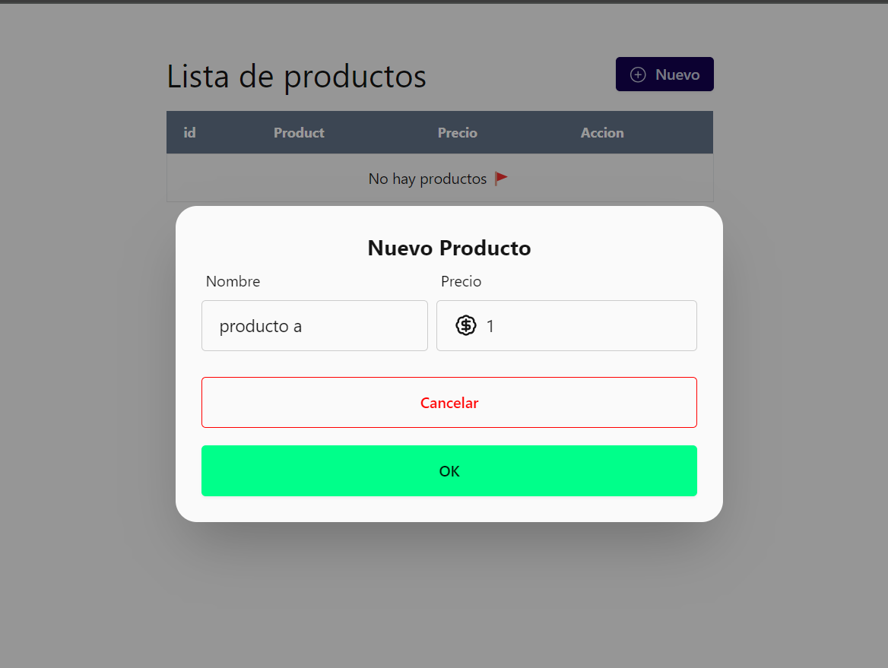
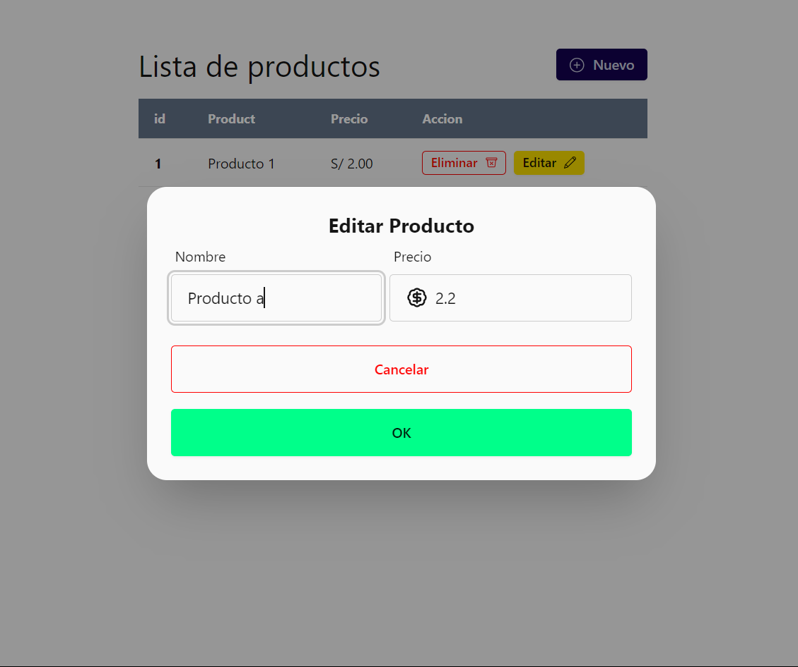

# CRUD Product Application

## Descripción

Esta es una aplicación CRUD para la gestión de productos, desarrollada con ASP.NET Core en el backend y React en el frontend.

## Características

- Crear, Leer, Actualizar y Eliminar productos.
- Interfaz de usuario intuitiva con React y Tailwind CSS.
- API RESTful en ASP.NET Core.

## Prerrequisitos

Asegúrate de tener instalados los siguientes componentes:

- [.NET 8 SDK](https://dotnet.microsoft.com/download/dotnet/8.0)
- [Node.js](https://nodejs.org/) (recomendado LTS)
- [MySQL](https://www.mysql.com/) (o tu base de datos preferida)

## Configuración del Proyecto

### Clona el repositorio:

   ```sh
    git clone https://github.com/contrerastrece/CRUD.git
   ```
### Backend

1.  Activar mysql

    
 
2. Crear BD y tabla:

   ```sql
      DROP DATABASE IF EXISTS productdb;

      CREATE DATABASE productdb;

      USE productdb;

      DROP TABLE IF EXISTS Product;

      CREATE TABLE Product (
          id INT AUTO_INCREMENT PRIMARY KEY,
          nombre VARCHAR(255) NOT NULL,
          precio DECIMAL(10, 2) NOT NULL
      );
   ```
3. Acceder a la carpeta back/api:

   ```sh
    cd back\api
   ```
4. Instalar dependencias
   ```sh
      dotnet restore
   ```

   
5. Configuración de back/api/appSettings.json:

   ```json
    {
      "ConnectionStrings": {
       "conection": "server=localhost;port=3306;uid=root;database=ProductDB"
        }
    }

6. Ejecutar el Back:
 
   ```sh
      dotnet run
   ```

### FRONTEND

1. Acceder a la carpeta:

   ```sh
    CRUD> cd front
   ```
2. Installar dependencias:
    ```sh
      npm install
    ```
3. Correr Proyecto:
    ```sh
      npm run dev
    ```

## Vistas

  ### Crear Producto
  

  ### Editar Producto
  